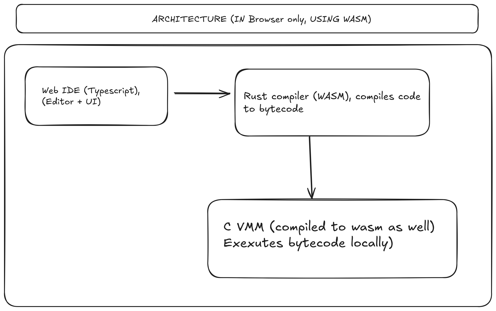

# Stack-based VM in C
A clean, minimal, and modular stack-based virtual machine written in C, inspired by the Java Virtual Machine (JVM).  
This project is built **purely for learning purposes**, to deeply understand virtual machines from the ground up.

---

## Here's the Architecture Diagram:


---

## 🚀 Project Goals

- Understand the inner workings of virtual machines.
- Learn systems-level C programming through hands-on implementation.
- Build components like:
  - Bytecode parser
  - Class loader
  - Instruction set interpreter
  - Operand and call stacks
  - Heap memory manager and garbage collector
  - A basic standard library (I/O, Math)

---

## 📁 Project Structure

```bash
stack_based_vm_in_c/
├── include/                            # Header files (API + internal)
│   ├── vm.h                            # VM struct and lifecycle
│   ├── class_loader.h                  # Class loading logic
│   ├── bytecode.h                      # Bytecode definitions and parser
│   ├── instructions.h                  # Instruction set
│   ├── stack.h                         # Stack and frame management
│   ├── heap.h                          # Heap & object memory management
│   ├── gc.h                            # Garbage collector
│   ├── types.h                         # Core types, enums, constants
│   ├── runtime.h                       # Main runtime entry point
│   ├── interpreter.h                   # Instruction dispatch loop
│   ├── stdlib/                         # Standard VM APIs (e.g., println, math)
│   │   ├── io.h
│   │   └── math.h
│   └── utils.h                         # Common utilities, error handling

├── src/                                # C source code files
│   ├── vm.c                            # VM struct and lifecycle (init, run, destroy)
│   ├── class_loader.c                  # Loads class files (.class, .myclass, etc.)
│   ├── bytecode.c                      # Bytecode parsing, validation
│   ├── instructions.c                  # Implement all opcodes
│   ├── stack.c                         # Operand stack, call stack
│   ├── heap.c                          # Object heap, memory allocation
│   ├── gc.c                            # Mark-and-sweep or generational GC
│   ├── runtime.c                       # Main execution flow
│   ├── interpreter.c                   # Instruction fetch-decode-execute
│   ├── stdlib/
│   │   ├── io.c                        # Built-in I/O support
│   │   └── math.c                      # Built-in math operations
│   └── utils.c                         # Logging, assertions, diagnostics

├── compiler/                           # Source-to-bytecode compiler
│   ├── lexer.c / lexer.h               # Tokenizer for your language
│   ├── parser.c / parser.h             # Parser (generates AST from tokens)
│   ├── ast.h                           # AST node structure
│   ├── codegen.c / codegen.h           # Bytecode generation from AST
│   ├── symbol_table.c / symbol_table.h # Tracks functions, variables
│   ├── tokens.h                        # Token definitions
│   ├── compiler_main.c                 # CLI frontend (e.g., ./myc program.mylang)
│   └── README.md                       # Notes on syntax, grammar, output format

├── tools/                              # Bytecode tooling
│   ├── assembler.c                     # Assembles .myasm → .myclass
│   ├── disassembler.c                  # Disassembles .myclass → readable
│   └── bytecode_defs.h                 # Shared opcode/instruction macros

├── tests/                              # Unit and integration tests
│   ├── test_vm.c
│   ├── test_stack.c
│   ├── test_gc.c
│   ├── test_instructions.c
│   └── test_bytecode.c

├── examples/                           # Sample programs
│   ├── HelloWorld.mylang               # Source file for your language
│   ├── Fibonacci.mylang
│   ├── HelloWorld.myclass              # Compiled bytecode file
│   ├── Fibonacci.myclass
│   └── Benchmark.myclass

├── build/                              # Build output (ignored in VCS)

├── docs/                               # Documentation
│   ├── architecture.md
│   ├── bytecode_spec.md
│   ├── vm_memory_model.md
│   ├── instruction_set.md
│   └── compiler_design.md              # Compiler internals, AST, grammar, etc.

├── Makefile                            # Build script
├── README.md                           # Project overview, usage, build
└── LICENSE                             # Open-source license
````

---

## 🛠️ Build

Use `make` to compile the entire project:

```bash
make
```

The binary will be placed under the `build/` directory.

---

## 🧪 Run Tests

To run unit tests:

```bash
make test
```

Tests validate core components like stack behavior, instruction execution, and GC.

---

## 📦 Examples

Sample bytecode programs in `examples/`:

* `HelloWorld.myclass`: prints output
* `Fibonacci.myclass`: recursive call test
* `Benchmark.myclass`: stress test

You can write `.myasm` and convert them using the custom assembler.

---

## 📚 Documentation

Docs are available in the `docs/` folder:

* `architecture.md`: High-level VM design
* `bytecode_spec.md`: Instruction format
* `vm_memory_model.md`: Heap, stack, GC details
* `instruction_set.md`: Full opcode reference

---

## ⚙️ Tools

Tools available under `tools/`:

* `assembler`: Converts human-readable `.myasm` to `.myclass`
* `disassembler`: Dumps `.myclass` into readable text

---

## ✅ Requirements

* C compiler (GCC or Clang)
* POSIX-compliant OS (Linux/macOS preferred)
* C99 or later

---

## 📌 Disclaimer

> This VM is not production-ready and is designed **solely for educational purposes**.
> The goal is clarity, simplicity, and a deeper understanding of how real VMs work.

---

## 📄 License

This project is licensed under the [MIT License](./LICENSE).

---

## 🙏 Acknowledgments

* Inspired by the Java Virtual Machine, Lua VM, and CPython internals.
* Thanks to the open-source community for learning resources.

---

## 🧠 My Intent For this Project

This project is for anyone who wants to:

* Truly understand what happens "under the hood" of programming languages
* Build their own VM, bytecode format, or compiler someday
* Get hands-on experience in systems-level C programming

---

## My Future Planning for this:
 1. Performance
 2. Optimization
 3. Profiling
 4. Benchmarking
 5. Debugging (it's a must skill, I am still learning this a lot.)

 ---